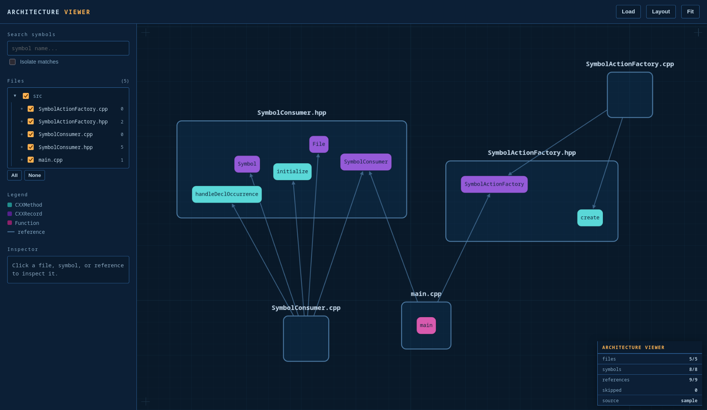

# Clang Architecture Generator

`clang-architecture` is a small utilitary based on [Clang](https://clang.llvm.org/)/[LLVM](https://llvm.org/) that aim
to extract and visualize the dependencies in a C/C++ program at the symbol level.

## Example

This project generate JSON reports that store where symbols are declared and how they are used.

Those reports can be combined with [the viewer](https://git.faraphel.fr/faraphel/clang-architecture-viewer)
in order to have a dynamic web visualization of the project analyzed.



## Requirements

### Project

Your project must match the following conditions:

1. Your project can compile with the `clang` compiler.
2. Your project should have a compilation database (`compile_commands.json`)
    - Using CMake, it can be generated by using `CMAKE_EXPORT_COMPILE_COMMANDS=ON`
    - Using another build system, [bear](https://github.com/rizsotto/bear) can wrap it to generate the file.

## Build

### Docker / Podman

You can use the OCI image in the [packages](https://git.faraphel.fr/faraphel/clang-architecture-viewer/packages) tab
directly to use this project, or you can build the image yourself using the `Dockerfile`.

```bash
docker build -t clang-architecture .
```

### Manual

#### Requirements

In order to build this project, your environment must match the following conditions:

1. The required packages should be installed: 

```bash
# Debian
sudo apt install clang libclang-dev llvm llvm-dev
``` 

To build this project, you only need to run cmake on it:

```bash
# configure the project
cmake --preset release
# build the project
cmake --build --preset release --parallel
```

## Usage

You can generate an architecture report for your project by adapting this command:

```bash
clang-architecture 
  -o=./architecture.json
  -p=./build/ 
  --extra-arg=-resource-dir=$(clang -print-resource-dir) 
  ./source/*
```

### Arguments

| Name                   | Description                                         | Type     | Required | Default      |
|------------------------|-----------------------------------------------------|----------|----------|--------------|
| `-o` / `--output`      | The output path for the report file                 | `string` |          | `-` (stdout) |
| `-p `                  | The build path where the compile database is stored | `string` | True     |              |
| `-k` / `--keep-system` | Should the symbols system be included in the report | `bool`   |          | `false`      |
| `--extra-arg`          | Extra arguments appended to the parser              | `any`    | False    |              |
| `--extra-arg-before`   | Extra arguments prepended to the parser             | `any`    | False    |              |
| `[...] sources`        | The sources files of the project                    | `string` | True     |              | 

### Tips

The internal parser used by this tool may require to know the location additional resources such as the system
headers of your compiler. It is recommended to pass them using the `--extra-arg` argument.

For `clang`, you can use `--extra-arg=-resource-dir=$(clang -print-resource-dir)` to include them.
